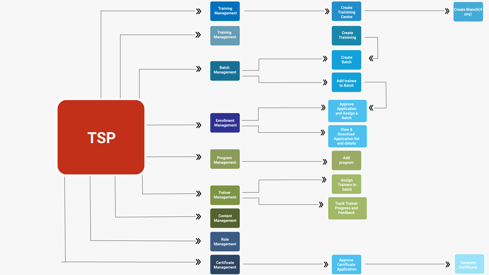
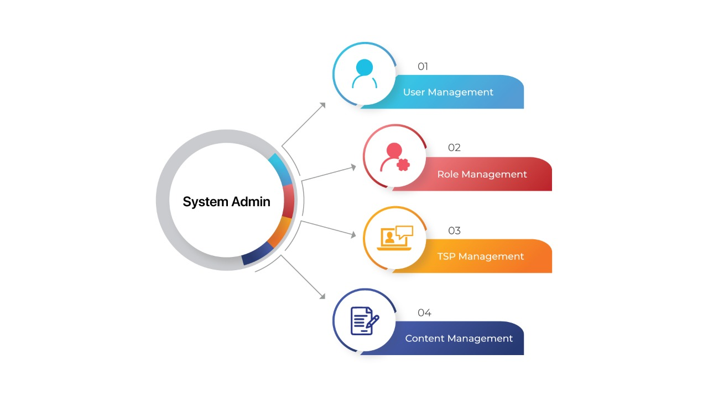
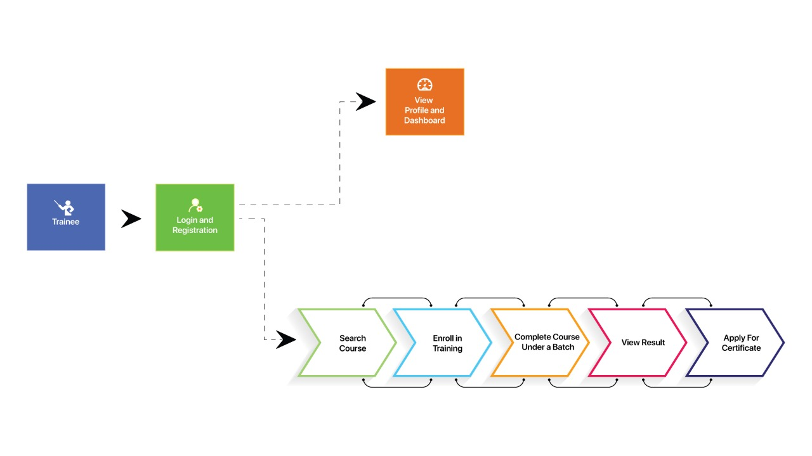
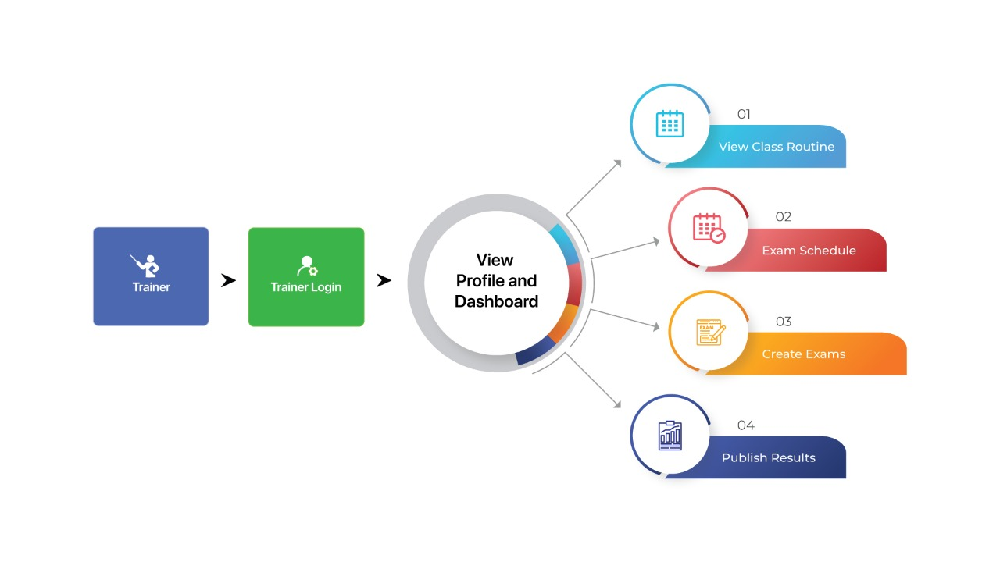

# Welcome to the Skills and certification management system

- [Installation](#installation)
- [Usage](#usage)
- [Admin Documentation](#admin-documentation)
- [Menu Builder](#menu-builder)
- [Developer Guide](#developer-guide)
- [Contributions and Support](#contributions-and-support)
- [License](#license)

- [Easy Installation](#easy-installation)
- [Server Setup](#server-setup)
    - [Linux Server Setup For Production Deployment](#linux-server-setup-for-production-deployment)
## Installation

```sh
git clone this-url
```

```sh
cd project-root
```

##### Install [composer](https://getcomposer.org/) dependencies of this project by running

```sh
composer install
```

##### Copy `.env-example` to `.env` and configure your database and other connection.

##### Run this two command also

```shell
php artisan key:generate
php artisan storage:link 
```

##### Run this command for migration and seeder

```shell
php artisan migrate:fresh --seed
```

##### Run this command to seed menu permission

```shell
php artisan db:seed --class=TablePermissionKeySeeder
```

##### Run this command to seed menu permission for system admin, institute admin, branch admin, training center admin and triner

```shell
php artisan db:seed --class=RoleWisePermissionSeeder
```

##### Run this command to clear all type of cache

```shell
php artisan cache:clear
```

```shell
php artisan optimize:clear
```


##### Run this command to start application

```shell
php artisan serve
```


## Usage

Go to the link `/user/login` like `http://127.0.0.1:8000/user/login` for login and enter the system admin credentials below.

##### Demo super admin credentials

```shell
email: admin@gmail.com
password: password
```

##### Demo system admin credentials

```shell
email: system-admin@gmail.com
password: password
```

##### Demo institute admin credentials

```shell
email: bitac@gmail.com
password: password

email: tfl@gmail.com
password: password
```

##### Demo trainee credentials

```shell
email: trainee@gmail.com
password: password
```

##### Demo trainer credentials

```shell
email: trainer@gmail.com
password: password
```

##### Demo branch admin credentials

```shell
email: branch@gmail.com
password: password
```

##### Demo training center admin credentials

```shell
email: training-center@gmail.com
password: password
```


## Admin Documentation

[Admin Documentation](docs/index.md) link.

## Menu Builder
After login as a system admin now you can import/export menu using menu builder. goto `/menu-builder/menus` like `http://127.0.0.1:8000/menu-builder/menus`, then for the first time press `import menu`
button. it will help you to import menu from menu-backup folder. If you create any menu, you could push it to git using
export.


## Content Management

#### Site Settings

Once menu list import completed please go to site settings menu, it's available into content management menu. Here all site settings is controlled and please update all settings mainly update valid credentials for mail setup.

### The following below menus wise update gradually

#### Intro Video 
#### Slider 
#### Gallery Album 
#### Gallery 
#### Video Category 
#### Video 
#### Static Page 
#### FAQ


## Developer Guide

### Basic Instruction

- All model should extend BaseModel class.
- All controller should extend BaseController class.

### Javascript Guideline

- use ```serverSideDatatableFactory()``` function for datatable.js rendering.

#### Date time helper. (Date time output format is always - ```Y-m-d H:i```)

- use .flat-date class to enable date input. **(input type should be text.)
- use .flat-time class to enable time input. **(input type should be text.)
- use .flat-datetime class to enable time input. **(input type should be text.)

### CSS/JS compilation

- There are no benefit to edit public/css or public/js file. If you need any customization, you have to edit it from
  resources/js or resources/sass, and then compile

### Policy & Permission

```php
$this->authorize('viewUserPermission', $user);
public function viewUserPermission(User $user, User $model)
{
    return $user->hasPermission('view_user_permission');
}
```

### File Handle

```php
App\Helpers\Classes\FileHandler::storePhoto(?UploadedFile $file, ?string $dir = '', ?string $fileName = ''): ?string
App\Helpers\Classes\FileHandler::deleteFile(?string $path): bool


// image storing example:
$filename = FileHandler::storePhoto($file, 'dirname', 'custom-file-name');
$user = new User();
$user->pic = 'dirname/'. $filename;
$user->save();
```

```html
<!--image show/retrieving example-->
pic)}}"/>
```

### Select2 API html format

Just add class ```select2-ajax-wizard``` to enable select2 on your select element

```html
<select class="form-control select2-ajax-wizard"
        name="user_id2"
        id="user_id2"
        data-model="{{base64_encode(Softbd\Acl\Models\User::class)}}"
        data-label-fields="{title} - {institute.title}"
        data-depend-on="user_type_id:#user_type_id"
        data-depend-on-optional="user_type_id:#user_type_id"
        data-dependent-fields="#name"
        data-filters="{{json_encode(['name' => 'Baker Hasan'])}}"
        data-preselected-option="{{json_encode(['text' => 'Baker Hasan', 'id' => 1])}}"
        data-placeholder="Select option"
>
    <option selected disabled>Select User</option>
</select>
```

***

##### Model ```data-model```

This will define which model you want to fetch.

Model namespace should encode using base64_encode. Otherwise, it won't work.

excepted format
```data-model="{{base64_encode(Softbd\Acl\Models\User::class)}}"```


***

##### Label Fields ```data-label-fields```

The definition of which field you want to fetch from model and display in select2.

```data-label-fields="{name}"```

if its relational column

```data-label-fields="{institute.title}"```

if you want to show multiple column.

```data-label-fields="{name} - {institute.title}"```

***

##### Depend on fields ```data-depend-on```

When the resource depends on some other input field, then

```data-depend-on="user_type_id"```

Here, user_type_id field value passed to ajax request for filter.

You may define column name and field name as well, Otherwise it will parse automatically

ID
```data-depend-on="user_type_id:#user_type_id"```

Class
```data-depend-on="user_type_id:.user_type_id"```

Name
```data-depend-on="user_type_id:[name=user_type_id]"```

***

##### Depend on optional ```data-depend-on-optional```

Where depend on always pass the value to ajax, but ```data-depend-on-optional``` only pass the value if the value isn't
empty.

```data-depend-on-optional="user_type_id:#user_type_id"```

selector criteria same as ```data-depend-on```.

***

##### Dependant field ```data-dependent-fields```

If any of the field dependent to this field, then.

```data-dependent-fields="#name_en"```

multiple
```data-dependent-fields="#name_en|.name_bn|[name=email]"```

***

##### Filters ```data-filters```

Additional filter.
```html
data-filters="{{json_encode(['name_en' => 'Hasan'])}}"
```
```html
data-filters="{{json_encode(['id' => [\App\Models\User::USER_TYPE_TRAINER_USER_CODE, 'type' => 'not-equal']])}}"
```
```html
data-filters="{{json_encode(['id' => [\App\Models\User::USER_TYPE_TRAINER_USER_CODE, 'type' => 'equal']])}}"
```

***

##### Scopes ```data-scopes```

Apply scopes.
```data-scopes="acl|bcl"```

***

##### Preselected option ```data-preselected-option```

```html
data-preselected-option="{{json_encode(['text' => 'Hasan', 'id' => 1])}}"
```

***

##### Placeholder ```data-placeholder```

```data-data-placeholder="Select User"```

### Fetch model using AJAX

```javascript
$.ajax({
    type: 'post',
    url: '{{route('web-api.model-resources')}}',
    data: {
        resource: {
            model: "{{base64_encode(\Softbd\Acl\Models\User::class)}}",
            columns: 'name_en|institute.title_en|institute.title_bn',
            scopes: 'acl',
        }
    }
}).then(function (res) {
    console.log(res);
});
```
## To set locale, locale currency and locale country code
Go to config/settings.php and set your locales 

## Contributions and Support

Thanks to [everyone](https://github.com/a2i-dpg/skills-and-certification/graphs/contributors)
who has contributed to this project!

Please see [CONTRIBUTING.md](CONTRIBUTING.md) to contribute.

If you found any bugs, Please report it using [Github](https://github.com/a2i-dpg/skills-and-certification/issues)

## License

Copyright 2022 @a2i, Bangladesh

Licensed under the Apache License, Version 2.0 (the "License");
you may not use this file except in compliance with the License.
You may obtain a copy of the License at

    http://www.apache.org/licenses/LICENSE-2.0

Unless required by applicable law or agreed to in writing, software
distributed under the License is distributed on an "AS IS" BASIS,
WITHOUT WARRANTIES OR CONDITIONS OF ANY KIND, either express or implied.
See the License for the specific language governing permissions and
limitations under the License.

## User flow diagram







## Easy Installation

## Server Setup

## Linux Server Setup For Production Deployment

<hr /> <br />

```shell
sudo apt-get update
```

#### install apache server
```shell
sudo apt-get install apache2
```

#### checking your Apache configuration for syntax errors:
```shell
sudo apache2ctl configtest
```

<!-- ### Install Db
```shell
sudo apt install mariadb-server
mysql_secure_installation
GRANT ALL ON *.* TO 'admin'@'localhost' IDENTIFIED BY 'password' WITH GRANT OPTION;
``` -->

### Install MySQL
```shell
sudo apt update
sudo apt install mysql-client mysql-server
sudo mysql_secure_installation

CREATE DATABASE laravel;
mysql -u root -p
CREATE USER 'laravel'@'localhost' IDENTIFIED BY 'secret';
GRANT ALL ON laravel.* to 'laravel'@'localhost';
FLUSH PRIVILEGES;
quit
```

### PHP 8.0 Install
```shell
sudo apt -y install php8.0

sudo apt-get install -y php8.0-cli php8.0-json php8.0-common php8.0-mysql php8.0-zip php8.0-gd php8.0-mbstring php8.0-curl php8.0-xml php8.0-bcmath

sudo apt-get install php8.0-mysqli

php -v
```

### Restart Apache
```shell
sudo service apache2 restart
```

### Composer Install 

Once php installed, need to install composer if not installed on machine. To install composer please follow following steps. [Reference link](https://getcomposer.org/download/)

```shell
php -r "copy('https://getcomposer.org/installer', 'composer-setup.php');"
php -r "if (hash_file('sha384', 'composer-setup.php') === '55ce33d7678c5a611085589f1f3ddf8b3c52d662cd01d4ba75c0ee0459970c2200a51f492d557530c71c15d8dba01eae') { echo 'Installer verified'; } else { echo 'Installer corrupt'; unlink('composer-setup.php'); } echo PHP_EOL;"
php composer-setup.php
php -r "unlink('composer-setup.php');"

sudo mv composer.phar /usr/local/bin/composer

composer -v
```

### Apache Config and  virtual hosts
```shell
    <Directory "/var/www/html">
        Options Indexes FollowSymLinks
        AllowOverride All
        Require all granted
    </Directory>
```

### copy the virtual config
```shell
vi [Real Domain Address or Dummy Domain Address Like (www.dummy-host.com)].conf
```

```shell
    <VirtualHost *:80>
        ServerName [Real Domain Address or Dummy Domain Address Like (www.dummy-host.com)]
        ServerAdmin webmaster@[Real Domain Address or Dummy Domain Address Like (www.dummy-host.com)]
        DocumentRoot /var/www/html

        <Directory /var/www/html>
            AllowOverride All
        </Directory>

        ErrorLog /var/www/html/error.log
        CustomLog /var/www/html/access.log combined
    </VirtualHost>
```

```shell
sudo a2dissite 000-default.conf
sudo a2ensite [Real Domain Address or Dummy Domain Address Like (www.dummy-host.com)]
sudo a2enmod rewrite
sudo systemctl restart apache2
```


